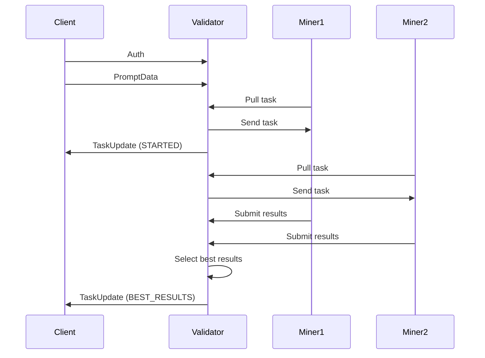

Our subnet allows validators to serve HTTP (websocket) endpoints that enable external clients to access the functionalities of the subnet.

# Short Version
To serve a public endpoint, follow these steps:
1. Enable the public API by adding `--public_api.enabled` to `neurons/validator.config.js`.
2. Set the server port for the public API by adding `--public_api.server_port 8888` (default value) to `neurons/validator.config.js` and ensure the port is open on your firewall.
3. Add a client API key using the following command:
   ```commandline
   scripts/api_key_cli.sh ~/.bittensor/miners/validator/default/netuid17/validator/api_keys.db add EWJzrqUL94r5BEz0ZLPUbEwD8qdQX18dCUF9B7C2e0 client-name 100 60
   ```
4. Wait for 30 minutes for the changes to take effect.

# Configuring the Validator
To start serving the public endpoint, you need to enable it in the configuration file:
1. Run the validator with the `--public_api.enabled` flag.
2. The default port for the public API is 8888. You can change this by setting `--public_api.server_port` to a different port number and opening the corresponding port on your firewall.

#### Other Public API Settings:
* `--public_api.copies`: Number of miners the validator assigns the task to. It selects the best result from the given copies. The default value is 4, which is a good balance between latency and redundancy. It is not recommended to change this setting.
* `--public_api.wait_after_first_copy`: The time in seconds the validator waits after receiving the first result before considering other results. This value defaults to a parameter that aims to balance data collection and response time. Adjustments to this parameter will be made in future releases.

# Configuring Client Access
Access to the public endpoint is regulated through API keys. 
It is recommended to create unique API keys for each client or partner and configure individual rate limits for them.
The validator stores API key information in an SQLite database located on the validator node. 
The default file name is `api_keys.db` and it resides in the `.bittensor` folder. 
For a validator with the coldkey named validator, the default location would be: `~/.bittensor/miners/validator/default/netuid17/validator/api_keys.db`.
A script (`api_key_cli.sh`) is provided in the `/three-gen-subnet/scripts` directory to manage the API keys database. 

**Validators synchronize API keys with the database every 30 minutes.** 

### All commands require specifying the path to the database.

#### Generate a New API Key:
```commandline
./api_key_cli.sh ~/.bittensor/miners/validator/default/netuid17/validator/api_keys.db gen
```

#### List All API Keys:
```commandline
./api_key_cli.sh ~/.bittensor/miners/validator/default/netuid17/validator/api_keys.db list
```

#### Add a New API Key:
To add an API key, provide a client name or alias, and specify rate limit parameters (number of requests per defined period). The first parameter is the number of requests, and the second is the interval in seconds.
```commandline
./api_key_cli.sh ~/.bittensor/miners/validator/default/netuid17/validator/api_keys.db add EWJzrqUL94r5BEz0ZLPUbEwD8qdQX18dCUF9B7C2e0 client-name 100 60
```
In this example, the client is allowed to make 100 requests per 60 seconds (1 minute).

#### Remove an API Key
```commandline
./api_key_cli.sh ~/.bittensor/miners/validator/default/netuid17/validator/api_keys.db remopve EWJzrqUL94r5BEz0ZLPUbEwD8qdQX18dCUF9B7C2e0
```

# Integrating with the public endpoint

## How It Works




### Explanation of the Sequence:

1. **Client Initiates Connection**:
    - `Client` connects to `Validator`.
    - `Client` sends authentication info (`Auth`).
    - `Client` sends `PromptData` to `Validator`.

2. **Miner 1 Interactions**:
    - `Miner 1` pulls a task from `Validator`.
    - The `Validator` sends the task details to `Miner 1`.
    - The `Validator` sends a task update (`STARTED`) to the `Client`.

3. **Miner 2 Interactions**:
    - `Miner 2` pulls a task from `Validator`.
    - The `Validator` sends the task details to `Miner 2`.

4. **Submit Results**:
    - `Miner 1` submits results back to `Validator`.

5. **Final Steps**:
    - `Miner 2` submits results back to `Validator`.
    - The `Validator` selects the best results.
    - The `Validator` sends a final task update (`BEST_RESULTS`) to the `Client`.

## Python client code example
```python
import asyncio
import base64
import json
from pathlib import Path

from aiohttp import ClientSession, WSMsgType
from validator.api.protocol import Auth, PromptData, TaskStatus, TaskUpdate


async def main() -> None:
    async with ClientSession() as session:
        async with session.ws_connect("wss://1qshev6dbe7gdz-8888.proxy.runpod.net/ws/generate/") as ws:
            await ws.send_json(Auth(api_key="API KEY").dict())
            await ws.send_json(PromptData(prompt="Donald Duck").dict())

            async for msg in ws:
                if msg.type == WSMsgType.TEXT:
                    update = TaskUpdate(**json.loads(msg.data))
                    if update.status == TaskStatus.STARTED:
                        print("Task started")
                    elif update.status == TaskStatus.BEST_RESULTS:
                        print(f"Best results. Score: {update.results.score}. Size: {len(update.results.assets)}")
                        with Path("results.ply").open("wb") as f:
                            f.write(base64.b64decode(update.results.assets.encode("utf-8")))
                elif msg.type == WSMsgType.ERROR:
                    print(f"WebSocket connection closed with exception: {ws.exception()}")


if __name__ == "__main__":
    asyncio.run(main())
```