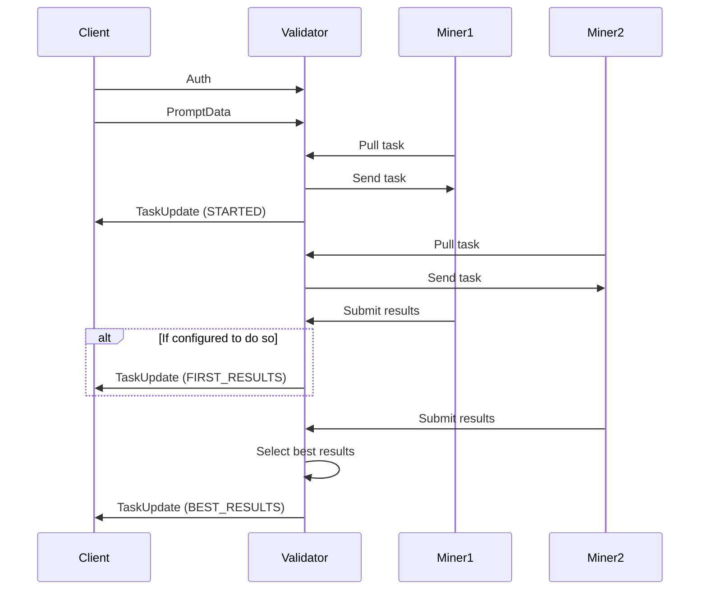

Draft:
Our subnet allows validators to run serve http (websocket) endpoint that allows external (external to subnet) clients to access the power (probably power is not the best word) of the subnet.

# Short version
To serve public endpoint you need to:
1. Add `--public_api.enabled` to `neurons/validator.config.js`.
2. Add `--public_api.server_port 8888` (default value) to `neurons/validator.config.js` and open the port.
3. Add client API key with `scripts/api_key_cli.sh ~/.bittensor/miners/validator/default/netuid17/validator/api_keys.db add EWJzrqUL94r5BEz0ZLPUbEwD8qdQX18dCUF9B7C2e0 client-name 100 60`
4. Wait for 30 minutes.

# Configuring the validator 
To start serving public endpoint, you need to turn it on. You need to run validator with `--public_api.enabled` flag.
By default `--public_api.server_port` is set to 8888, you can change it and open corresponding port on your firewall.

Other public API settings:
`--public_api.copies` - validator will give the task to `--public_api.copies` miners and pick the best results. It's not recommended to change this settings. Default value 4 is considered a good balance between  latency and redundancy.
`--public_api.wait_after_first_copy` - once the first results are received, validator will wait for `--public_api.wait_after_first_copy` seconds to let other miners to finish with their task. It's not recommended to change this value. More data will be collected and this parameter will be adjusted in a future releases.

# Configuring client access
Access to the public endpoint is regulated with API keys. It's recommended to create unique API key for each partner (or frontend) and configure the individual rate limits.
Validator stores API key information in the SQL lite database stored on the validator node. File name: `api_keys.db`. And it's stored in the .bittensor folder. If you validator coldkey is named `validator`, default location would be here: ~/.bittensor/miners/validator/default/netuid17/validator/api_keys.db

We provide a simple `api_key_cli.sh` located in `/three-gen-subnet/scripts` dir to work with API keys database.

Validator synchronizes API keys with the database every 30 minutes.

All commands require specifying the path to the database. 

## Generate new API key
```commandline
./api_key_cli.sh ~/.bittensor/miners/validator/default/netuid17/validator/api_keys.db gen
```

## List all API keys
```commandline
./api_key_cli.sh ~/.bittensor/miners/validator/default/netuid17/validator/api_keys.db list
```

## Add new API key
To add new client API key you need to provide some client name or alias, and specify rate limit parameters (number of requests per defined period).
The first parameter defines the number of requests, the second interval in seconds.
```commandline
./api_key_cli.sh ~/.bittensor/miners/validator/default/netuid17/validator/api_keys.db add EWJzrqUL94r5BEz0ZLPUbEwD8qdQX18dCUF9B7C2e0 client-name 100 60
```
In this example, client would be allowed to do 100 requests per 60 seconds (1 minute).

## Remove API key
```commandline
./api_key_cli.sh ~/.bittensor/miners/validator/default/netuid17/validator/api_keys.db remopve EWJzrqUL94r5BEz0ZLPUbEwD8qdQX18dCUF9B7C2e0
```

# Integrating with the public endpoint

## How it works




### Explanation of the Sequence:

1. **Client Initiates Connection**:
    - `Client` connects to `Validator`.
    - `Client` sends authentication info (`Auth`).
    - `Client` sends `PromptData` to `Validator`.

2. **Miner 1 Interactions**:
    - `Miner 1` pulls a task from `Validator`.
    - The `Validator` sends the task details to `Miner 1`.
    - The `Validator` sends a task update (`STARTED`) to the `Client`.

3. **Miner 2 Interactions**:
    - `Miner 2` pulls a task from `Validator`.
    - The `Validator` sends the task details to `Miner 2`.

4. **Submit Results**:
    - `Miner 1` submits results back to `Validator`.
    - Optionally, the `Validator` sends a task update (`FIRST_RESULTS`) to the `Client`.

5. **Final Steps**:
    - `Miner 2` submits results back to `Validator`.
    - The `Validator` selects the best results.
    - The `Validator` sends a final task update (`BEST_RESULTS`) to the `Client`.

## Python client code example
```python
import asyncio
import base64
import json
from pathlib import Path

from aiohttp import ClientSession, WSMsgType
from validator.api.protocol import Auth, PromptData, TaskStatus, TaskUpdate


async def main() -> None:
    async with ClientSession() as session:
        async with session.ws_connect("wss://1qshev6dbe7gdz-8888.proxy.runpod.net/ws/generate/") as ws:
            await ws.send_json(Auth(api_key="API KEY").dict())
            await ws.send_json(PromptData(prompt="Donald Duck", send_first_results=True).dict())

            async for msg in ws:
                if msg.type == WSMsgType.TEXT:
                    update = TaskUpdate(**json.loads(msg.data))
                    if update.status == TaskStatus.STARTED:
                        print("Task started")
                    elif update.status == TaskStatus.FIRST_RESULTS:
                        print(f"First results. Score: {update.results.score}. Size: {len(update.results.assets)}")
                    elif update.status == TaskStatus.BEST_RESULTS:
                        print(f"Best results. Score: {update.results.score}. Size: {len(update.results.assets)}")
                        with Path("results.ply").open("wb") as f:
                            f.write(base64.b64decode(update.results.assets.encode("utf-8")))
                elif msg.type == WSMsgType.ERROR:
                    print(f"WebSocket connection closed with exception: {ws.exception()}")


if __name__ == "__main__":
    asyncio.run(main())
```